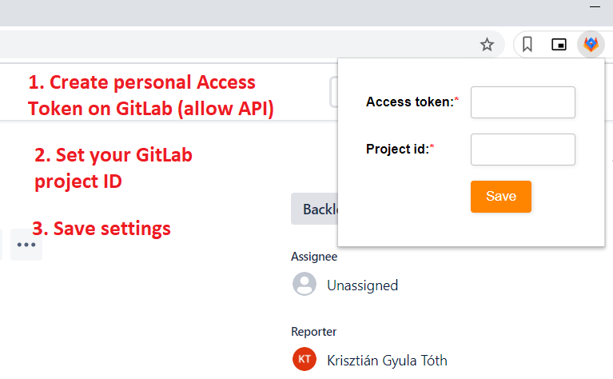
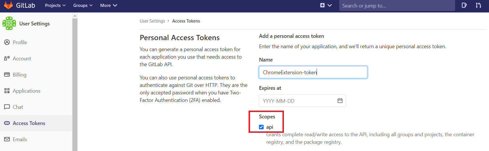
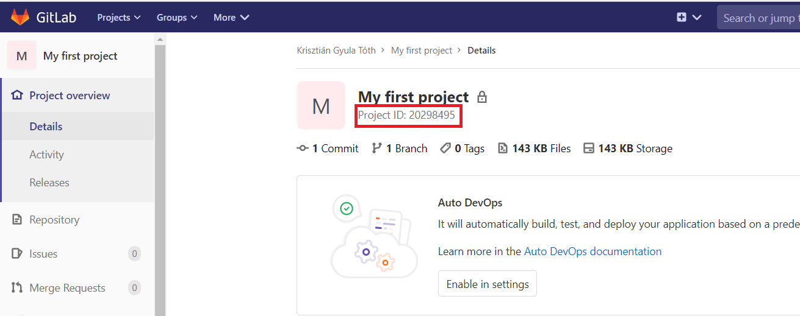
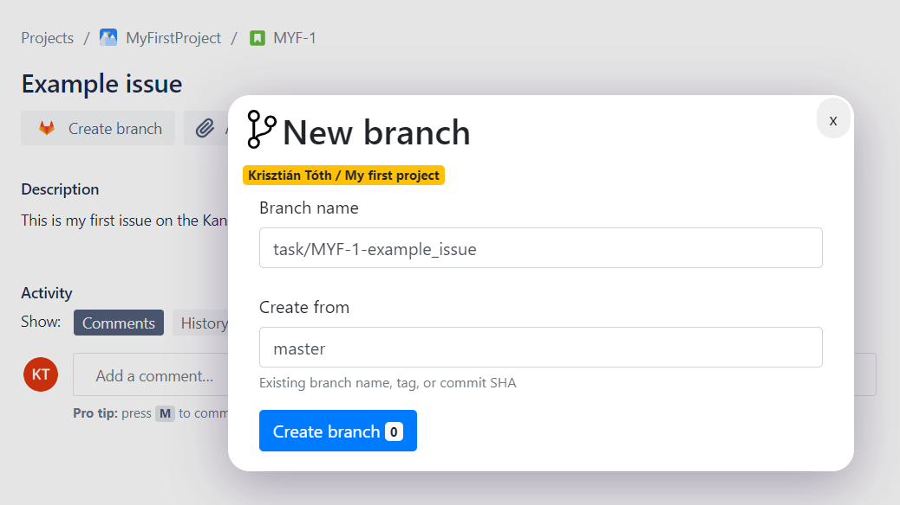
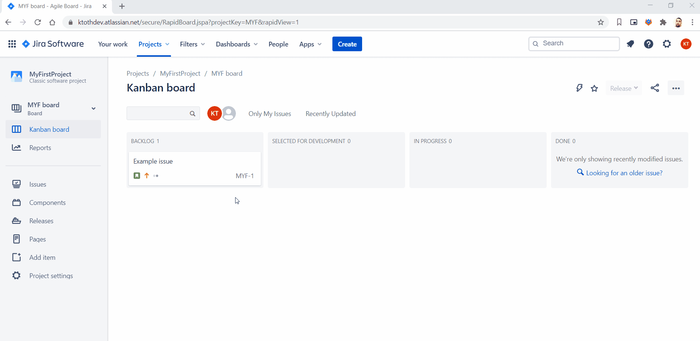

# Jira & GitLab integration - Create new branch from Issue
The extension adds a new `Create branch` button to the Jira Issue overview control buttons under the issue title. If you wish to open new branches for your ticket you've just started working on, this extension could help.

## Description
The extension makes it easier to create new branches on GitLab directly from Jira. Adds a new button to the issue overview page. After clicking this button a modal appears. On this modal you can specifiy the desired name for the new branch and the refence where it will be created from. You can also always notice the GitLab project where it will be created under. Currently only one project/repo supported. 
For perfoming the create branch action the extension uses the GitLab API endpoints. See the [GitLab API docs](https://docs.gitlab.com/ee/api/)!
If the branch created successfully then a success notif should popup. If something went wrong you will see browser alerts.

### Add to your Chrome
//TODO: Here comes the chromeStore link

### How to configure
To reveal the extension settings simply click on the extension icon in the extensions toolbar. On the popup you have to set the access token and the project id from GitLab.

#### 1. Generate access token
In order to get access to the GitLab APIs you must create an access token first in your profile with allowing the api usage (only). Then you should copy the generated key.

#### 2. Copy the project Id
The project id can be found on the project`s overview page on GitLab. 

3. Save
Don't foget to click the ´Save´ button. After you have saved the values the extension is ready to use.

## Screenshots
### Create branch modal

## In action

