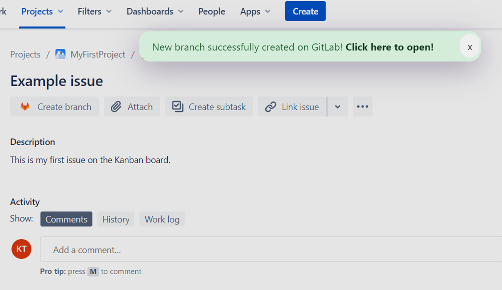

# Jira & GitLab integration - Create new branch from Issue
The extension adds a new `Create branch` button to the Jira Issue overview control buttons under the issue title. If you wish to open new branches for your ticket there is no need to navigate to you GitLab project anymore.

//TODO: Here comes the chromeStore link

## Description
The extension makes it easier to create new new branches on GitLab directly from Jira. Adds a new button to the issue overview page. After clicking this button a modal appears. On this modal you can specifiy the desired name for the new branch and the refence where to crete it from. Perfoming the create branch action the extension uses the GitLab API endpoints.

### How to configure
To reveal the extension settings simply click on the extension icon in the extensions toolbar.

On the popup you also have to specify one of your GitLab project ID.

In order to get access to the GitLab APIs you must create an access token in your profile with allowing the api usage (only). Then you should copy the key and set it in the extension.

The project id is visible on the project`s overview page on GitLab. After you have saved the settings the extension is ready to use.

## Screenshots

## In action

